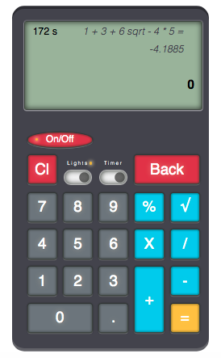

# smc Pocket Calculator v.1.0.0

#### Powered by CSS, HTML & JavaScript
 

> Every software app can be written in more ways, so I hope that you like mine.

 

 

I started this little project as a challenge for myself to see how hard is to build a poket calculator interface.
First I made just the body, buttons for the Numbers and for the Math operations and the screen. As the project advanced I added the switch buttons for Lights and Timer (autoclose) , then a Clear screen and a Delete buttons. After I added an On/Off button. Then I thinked that would be cool to add a history for operations, so I made the screen larger. After that I thinked that if I arrived until here would be cool to add a keyboard suport too.
So initialy I developed this app just for the UI, building the calculator with the help of CSS (Bootstrap + CSS) and HTML (PUG), then I added the push buttons simulation and the lights on keyboard and screen with the help of CSS and JavaScript.
After that I added a little code to intercept the click events for buttons and to add suport for math operations, and of course, to display the results on the screen.
In the end, the easyest part was to add suport for keyboard keys.

Even if I wrote the code using a Node server for auto refresh the browser window, I choosed to use just one file for JavaScript. So at least for now, the js code isn't split in MVC model.
Anyhow, I think that is good app to exercise the base of JavaScript, because in the code I covered a lot of principles. The code is very well commented.

You can see the app online on https://codepen.io/smcstylus/full/Yzxzzqy (for some reasons the history doesn't appear on codepen)

## Technology used:

- HTML: [PUG template engine][pug]
- CSS: CSS3, [Bootstrap 5][bootstrap]
- JavaScript: Vanila JS (ES6), [jQuery 3.4.1][jquery]
- Fonts: [FontAvesome5][fontawesome], Urbanist, Quicksand

## Features

- **_Interface_**
  - Simulate the press of the UI buttons when the (laptop/keyboard..) trackpad or on mobile screens is clicked, or keyboard keys are pressed/released
  - On/Off button
  - Autoclose (timer) switch. Reset timer on each UI button or keyboard only on allowed keys pressed.
  - Lights switch (lighten buttons and the screen)
  - Clear screen button
  - Backspace (delete) button
  - Decimal button
  - Numbers buttons
  - Math buttons
  - Autosize entire calculator by changing just the "--numPad-size" value in the CSS file
- **_Display_**
  - Display history of operations with all the operations. Scrollable area. Autoscroll to last result when is inserted (hit "Enter" or "=" keys").
  - Display previous result
  - Display current operation sign
  - Display curent number
- **_Others_**
  - Use UI buttons or keyboard keys
  - Use JavaScript object as memory to store different variables
  - Use custom decimals (0 - 8). To be set in calcMemory constant
  - Math operations: + - \* / % sqrt
- **_Keyboard Shortcuts_**
  - p - On/Off
  - c - Clear Screen
  - l - Switch Ligts 
  - t - Switch Timer 
  - q - sqrt 
  - 0-9 
  - + 
  - - 
  - / 
  - *
  - = or Enter - equal
  - Delete or Backspace - delete
  
## Tested on:
macOs Hight Siera - Firefox, Chrome, Opera GX 
Android
   
I don't studied a pocket calculator to see the results for long numbers, so the math part is not to precisely. I suggest you to replace that part of code (  _computeMath(), doMath(), mathFunctions()_ ) with your if you want to use this app in one of your projects. I limited more parts so please do it in a propper way if you will use it.

Below you can see what I used to build the JavaScipt code:

## JavaScript Vanila:

### Variables

    let
    const

## Strings

##### Template Literals

    `My text followed by ${javascript}`

##### String length

    string.length

##### String split()

    str.split(separator)

##### String trim()

    string.trim()

##### Substring

    string.substring(start, length)

##### String indexOf()

    string.indexOf(needle)

##### String toLowerCase()

    string.toLowerCase()

##### String endsWith()

    string.endsWith(value)

## Numbers

    number.toFixed(decimals_nr)
    isNaN(value)
    parseInt(value)
    parseFloat(value)
    Number.MAX_VALUE
    Number.MIN_VALUE
    Number.MAX_SAFE_INTEGER
    Number.MIN_SAFE_INTEGER

## Comparasion operators

    !=
    !==
    ===
     <
    >

## Logical operators

    &&
    ||
    object?.key

## Arithmetic operators

    +
    -
    *
    /

## Bitwise operators

    !!~

## Asigments

    +=

## Math

    Math.sqrt(nr)

## Conditionals

##### If, Else, Else If Statements

    if
    else if
    else

##### Ternary Operator

    istrue ? cond1 : cond2

##### Switch

    switch(cond){
      case a:
          // code block to be executed
      breake;
      case b:
          // code block to be executed
      break;
      default:
        // code block to be executed
    }

## Objects/Multidimensional arrays

    let myObject1 = {
      key1 : value1,
      Key2 : value2,
    }

 

    const myObject2 = {
      key1: {
        key11 : value11,
      },
      key2 : value2
      key3 : [value31, value32,value33],
    };

##### Object destructuring

    let object = {
      var1 : val1,
      var2 : val2,
    };
    let {var1, var2} = object;

## Array methods

##### Array push()

    array.push(new_value)

##### Array includes()

    array.includes(condition)

##### Array indexOf()

    array.indexOf(needle)

## DOM manipulation

    parent.getElementById(element_id)
    parent.getElementsByTagName(tag_name)
    parent.createElement(child_tag_name)
    parent.removeChild(child)
    parent.appendChild(new_element)
    element.setAttribute(attribute, value)
    element.createTextNode(string)
    element.blur()

## Arrow functions

    const myFunction = () => returned;
    const myFunction = (arguments) => {
      // code block to be executed
    };

## Previous ES6 function

    function myFunction() {
      // code block to be executed
    }

## IIFE function

    (function () {
        // code block to be executed
    })();

## Default parameters

    const myFunc = (argument = default_value) => {}

## Loops

##### For

    for(let i=x; i<y; i++){
        // code block to be executed
    }

##### For In

    for (let element in object) {
        // code block to be executed
    }

##### Break Statement

    break; // used in for in this case

## Events

    event.preventDefault()
    event.key

## Timers

##### Timeout

    setTimeout(function() {
        // code
    }, milliseconds)

##### Interval

    let timer = setInterval(function(){
        //code
    }, milliseconds);
    clearInterval(timer);

## JSON

##### Stringify

      JSON.stringify(object)

##### Parse

      JSON.parse(string)

## RegExp

    string.replace(/"/g, "'")

---

## jQuery:

### Events - mouse

    .on("click", function(e))
    .on("mousedown", function(e){})
    .on("mouseup", function(e){})
    .on("mouseleave", function(e){})

### Events - keyboard

    .keydown(function(e){})
    .keyup(function(e){})

### Events - form

    .on("change", function(e){})

### Selectors - element

    $(this)

### Traversing - filtering

    .is(":checked")

### Traversing - tree traversal

    .find(selector)

### Manipulation - DOM

    .text(myText)
    .html(myHTML)
    .append(element)

### Manipulation - class atribute

    .addClass()
    .removeClass()

### Manipulation - offset

    .scrollTop(value)
    .position()

### Manipulation - attributes

    .prop(propertyName)

### Loops - Traversing - manipulation

##### Each

    $(elements).each(function(index){});

## License

MIT

**Free Software!**

[//]: # "Author: Mihai Calin Simion | Date: October 2021"
[css]: https://www.w3schools.com/css/
[bootstrap]: https://getbootstrap.com/docs/5.0/getting-started/introduction/
[html]: https://www.w3schools.com/html/
[js]: https://www.javascript.com/
[jquery]: http://jquery.com/
[fontawesome]: https://fontawesome.com/
[pug]: http://pugjs.org/
[maingithub]: http://smcstylus.github.io/
[pen]: http://codepen.io/smcstylus/
[//]: # "md editor: https://dillinger.io/"
